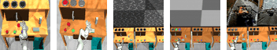

# RoboDesk with A Diverse Set of Distractors

A Multi-Task Reinforcement Learning Benchmark with A Diverse Set of Distractors



This repository contains a version of [RoboDesk](https://github.com/google-research/robodesk) that supports a rich set of challenging distractors, including camera and lighting noises, and even natural video noises. The distractors can be individually switched on or off. When they are all off (default), the environment behaves identically to the original RoboDesk.  Support for these distractors is done by [Tongzhou Wang](https://ssnl.github.io/).

If you find this open source release useful, please reference the following entries in your paper:

```
@misc{wang2022robodeskdistractor,
  author = {Tongzhou Wang},
  title = {RoboDesk with A Diverse Set of Distractors},
  year = {2022},
  howpublished = {\url{https://github.com/SsnL/robodesk}},
}

@misc{kannan2021robodesk,
  author = {Harini Kannan and Danijar Hafner and Chelsea Finn and Dumitru Erhan},
  title = {RoboDesk: A Multi-Task Reinforcement Learning Benchmark},
  year = {2021},
  howpublished = {\url{https://github.com/google-research/robodesk}},
}
```

## Highlights

- **Diversity:** RoboDesk includes 9 diverse tasks that test for a variety of different behaviors within the same environment, making it useful for evaluating transfer, multi-task learning, and global exploration.
- **Complexity:** The high-dimensional image inputs contain objects of different shapes and colors, whose initial positions are randomized to avoid naive memorization and require learning algorithms to generalize.
- **Robustness:** We carefully designed and tested RoboDesk to ensure fast and stable physics simulation. This avoids objects from intersecting, getting stuck, or quickly flying away, a common problem with some existing environments.
- **Lightweight:** RoboDesk comes as a self-contained Python package with few dependencies. The source code is clean and pragmatic, making it a useful blueprint for creating new MuJoCo environments.
- **Distractors:** RoboDesk provides an easy-to-use API to turn on various distractors, i.e., environment noises. Available distractors include
  - Shaky and flickering *environment headlights*;
  - Shaky *camera movements*;
  - *TV* playing natural videos, with hue controlled by buttons;
  - Noisy *button sensor*, affecting the indicator lights on desks and TV hue.

## Training Agents

The environment follows the [OpenAI Gym][gym] interface:

```py
import robodesk

env = robodesk.RoboDesk(seed=0)
obs = env.reset()
assert obs.shape == (64, 64, 3)

done = False
while not done:
  action = env.action_space.sample()
  obs, reward, done, info = env.step(action)
```

[gym]: https://github.com/openai/gym


## Tasks

Crucially,  the `tv_green_hue` task gives out reward based on a distractor (TV image green-ness), but its optimal strategy is agnostic of the distractor state (i.e., simply always pushing the button).

| Task | Description |
| :-------- | :---------- |
| `open_slide` | Push the sliding door all the way to the right, navigating around the other objects.  |
| `open_drawer` | Pull the dark brown drawer all the way open. |
| `push_green` | Push the green button to turn the green light on. |
| `stack_blocks` | Stack the upright blue block on top of the flat green block. |
| `upright_block_off_table` | Push the blue upright block off the table.  |
| `flat_block_in_bin` | Push the green flat block into the blue bin.  |
| `flat_block_in_shelf` | Push the green flat block into the shelf, navigating around the other blocks.  |
| `lift_upright_block` | Grasp the blue upright block and lift it above the table.  |
| `lift_ball` | Grasp the magenta ball and lift it above the table. |
| `tv_green_hue` | Push the green button to affect the TV hue to be more green. |


## Environment Details

### Constructor

Two entry points are available:
+ `robodesk.RoboDesk`: A regular RoboDesk environment with top-down camera view of the desk.
+ `robodesk.RoboDeskWithTV`: A RoboDesk environment with a TV placed in the scene, and a further camera view looking at three desks and the TV. The leftmost desk is where the robot operates.

```py
# Regular environment
robodesk.RoboDesk(task='open_slide', reward='dense', action_repeat=1, episode_length=500, image_size=64)

# Environment with noisy camera
robodesk.RoboDesk(task='open_slide', reward='dense', action_repeat=1, episode_length=500, image_size=64, distractors={'camera'})

# Environment with a TV in scene and all distractors turned on
robodesk.RoboDeskWithTV(task='open_slide', reward='dense', action_repeat=1, episode_length=500, image_size=64, distractors="all")
```

| Parameter | Description |
| :-------- | :---------- |
| `task` | Available tasks are `open_slide`, `open_drawer`, `push_green`, `stack`, `upright_block_off_table`, `flat_block_in_bin`, `flat_block_in_shelf`, `lift_upright_block`, `lift_ball`.  |
| `reward` | Available reward types are `dense`, `sparse`, `success`. Success gives only the first sparse reward during the episode, useful for computing success rates during evaluation. |
| `action_repeat` | Reduces the control frequency by applying each action multiple times. This is faster than using an environment wrapper because only the needed images are rendered. |
| `episode_length` | Time limit for the episode, can be `None`. |
| `image_size` | Size of the image observations in pixels, used for both height and width. |
| `distractors` | Configures distractors. `"all"` turns on all distractors, `"none"` turns off all of them. <br> Can also be a subset of all available distractors: `{'camera', 'env_light', 'button'}` for `RoboDesk`; and `{'camera', 'env_light', 'button', 'tv}` for `RoboDeskWithTV`. |
| `tv_video_file_pattern`<br>(Only for `RoboDeskWithTV`) | Glob pattern that specifies the TV video files to use. Requires [`scikit-video`](http://www.scikit-video.org/stable/) to be installed. |

### Reward

All rewards are bound between 0 and 1. There are three types of rewards available:

- Dense rewards are based on Euclidean distances between the objects and their target positions and can include additional terms, for example to encourage the arm to reach the object. These are the easiest rewards for learning.
- Sparse rewards are either 0 or 1 based on whether the target object is in the target area or not, according to a fixed threshold. Learning from sparse rewards is more challenging.
- Success rewards are equivalent to the sparse rewards, except that only the first reward is given during each episode. As a result, an episode return of 0 means failure and 1 means sucess at the task. This should only be used during evaluation.

### Termination

Episodes end after 500 time steps by default. There are no early terminations.

### Observation Space

Each observation is a dictionary that contains the current image, as well as additional information. For the standard benchmark, only the image should be used for learning. The observation dictionary contains the following keys:

| Key | Space |
| :-- | :---- |
| `image` | `Box(0, 255, (64, 64, 3), np.uint8)` |
| `qpos_robot` | `Box(-np.inf, np.inf, (9,), np.float32)` |
| `qvel_robot` | `Box(-np.inf, np.inf, (9,), np.float32)` |
| `qpos_objects` | `Box(-np.inf, np.inf, (26,), np.float32)` |
| `qvel_objects` | `Box(-np.inf, np.inf, (26,), np.float32)` |
| `end_effector` | `Box(-np.inf, np.inf, (3,), np.float32)` |

### Action Space

RoboDesk uses end effector control with a simple bounded action space:

```
Box(-1, 1, (5,), np.float32)
```

## Acknowledgements
We thank Ben Eysenbach and Debidatta Dwibedi for their helpful feedback.


Our benchmark builds upon previously open-sourced work. We build upon the desk XMLs first introduced in [[1]](https://github.com/google-research/google-research/tree/master/playrooms), the Franka XMLs open-sourced in [[2]](https://github.com/vikashplus/franka_sim), and the Franka meshes open-sourced in [[3]](https://github.com/frankaemika/franka_ros/tree/kinetic-devel/franka_description).

## Questions

Please [open an issue][issues] on Github.

[issues]: https://github.com/google-research/robodesk/issues

Disclaimer: This is not an official Google product.
